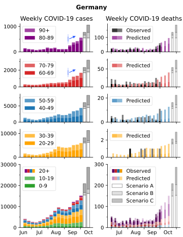
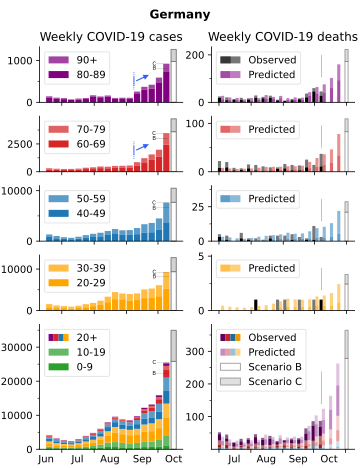

# Comparison of IFR, cases and deaths

* <a href="https://www.medrxiv.org/content/10.1101/2020.07.23.20160895v5">Levin, Hanage et .al</a> is taken as a basis for age-dependent IFR
* simplified to 10x per every 20 years of age, IFR=10% at age 82, treating age group 80-84 as IFR(82).
* age-stratified reported new cases per week and deaths per week are analyzed
* age groups of reported cases are multiplied by the age dependent IFR and shifted two weeks in the past, those are the predicted deaths

  
  

